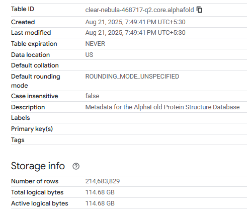
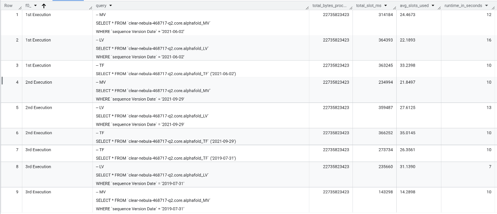

# BigQuery Views Performance Benchmark
This project benchmarks and compares the performance of Table Functions, Logical Views, and Materialized Views in Google BigQuery.
The goal is to understand trade-offs between query cost, execution speed, and usability when choosing the right approach for analytics pipelines.

## BigQuery View Types Comparison

| Type               | What is it? | Why use it? | Not good for |
|--------------------|-------------|-------------|--------------|
| [**Materialized View**](https://cloud.google.com/bigquery/docs/materialized-views-intro) | Precomputed view that stores results and refreshes automatically. | - Speeds up repeated queries<br>- Reduces query cost<br>- Ideal for dashboards & recurring analytics | - Highly volatile data (refresh overhead)<br>- Queries with unsupported features (e.g., non-deterministic functions) |
|  [**Logical View**](https://cloud.google.com/bigquery/docs/views)  | Saved SQL query definition, always executed at runtime on latest data. | - Simplifies query reuse<br>- Ensures always fresh data<br>- Centralizes complex SQL logic | - Performance-sensitive workloads<br>- Expensive queries run frequently |
| [**Table Function**](https://cloud.google.com/bigquery/docs/table-functions-intro) | Parameterized SQL function that returns a table. | - Flexible & reusable<br>- Promotes modular/DRY SQL<br>- Good for dynamic variations | - No caching/precomputation<br>- Complex ETL-like transformations |


## Setup
This project uses the public dataset **DeepMind AlphaFold** metadata as the source table. 
We create a working copy inside our project for benchmarking.
```sql
CREATE OR REPLACE TABLE `<your-project-id>.core.alphafold` AS
SELECT *
FROM `bigquery-public-data.deepmind_alphafold.metadata`;
```
### Table Details




Using this working replica, we can create the required Logical, Materialized views and Table functions.


- **Materialized View:** `<your-project-id>.core.alphafold_MV`
- **Logical View:** `<your-project-id>.core.alphafold_LV`
- **Table Function:** `<your-project-id>.core.alphafold_TF`

The DDLs for these can be found in this path `/ddl/<view_type>.sql`

## Testing
For testing, we will be querying these views using three different Date filters for the `Sequence Version Date` column, then obtaining the query execution times, number of bytes processed and number of slots used during run from the `INFORMATION_SCHEMA.JOBS` view in Bigquery.

### Example:
```sql
-- Query the materialized view
SELECT * FROM `<your-project-id>.core.alphafold_MV`
WHERE `sequence Version Date` = '2021-06-02'

-- Query the logical view
SELECT * FROM `<your-project-id>.core.alphafold_LV`
WHERE `sequence Version Date` = '2021-06-02'

-- Query the table function
SELECT * FROM `<your-project-id>.core.alphafold_TF` ('2021-06-02')
```

```sql
-- Obtain the query metrics from the JOBS view
SELECT
query,
total_bytes_processed,
total_slot_ms,
FORMAT('%0.4f',total_slot_ms / (TIMESTAMP_DIFF(end_time, creation_time, MILLISECOND))) AS avg_slots_used,
TIMESTAMP_DIFF(end_time, creation_time, SECOND) AS runtime_in_seconds
FROM
    `region-us`.INFORMATION_SCHEMA.JOBS
WHERE
    job_id IN (/*Add bq job detail here*/)
```


## Overall Results


### Execution Time
| Type               | #1 Query Execution Time | #2 Query Execution Time | #3 Query Execution Time | Avg. Execution Time |
|--------------------|-----------------------|-----------------------|-----------------------|-----------------------|
| Logical View       | 16 s                | 12  s                | 7 s                | 11.6 s                |
| Materialized View  | 12 s                | 10  s                | 9 s                | 10.3 s                |
| Table Function     | 10 s                | 10  s                | 10 s               | 10.0 s                |

### Slot Usage
| Type               | #1 Slot Usage | #2 Slot Usage | #3 Slot Usage | Avg. Slot Usage | 
|--------------------|-----------------------|-----------------------|-----------------------|-----------------------|
| Logical View       | 22.1893                | 27.6125               | 31.1390                |26.98                |
| Materialized View  | 24.4673                | 21.8497               | 14.2898                |20.20                |
| Table Function     | 33.2398               | 35.0145                | 26.3561                |31.53                |


## Conclusion

- **Materialized Views** achieved the best balance, with faster average runtime (10.3s) compared to logical views and significantly lower slot usage (~20.2). This makes them highly suitable for repeated queries and dashboard workloads where cost and performance both matter.

- **Table Functions** provided the most consistent execution times (~10s across all runs), making them reliable for reusable, parameterized queries. However, they consumed the highest average slots (~31.5), which could lead to higher resource usage for large-scale workloads.

- **Logical Views** were the slowest overall (avg. 11.6s) and required more slots than materialized views, as they always recompute the query from scratch. They are best suited for ensuring always up-to-date results but not for performance-critical pipelines.
